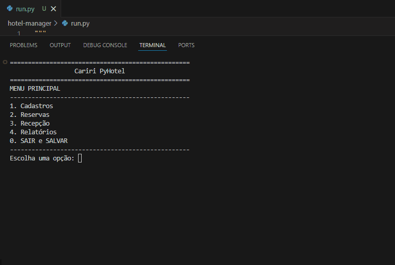
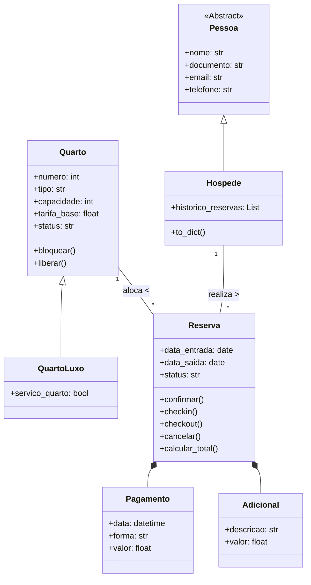

# Sistema de Reservas de Hotel


Projeto para a disciplina de Programação Orientada a Objetos (POO) da Universidade Federal do Cariri (UFCA).

## Descrição e Objetivo

Este é o sistema de gerenciamento de reservas para um hotel, desenvolvido em **Python** e estruturado com princípios de POO, como **herança**, **encapsulamento** e **composição**. A aplicação consiste em uma **interface de linha de comando (CLI)**, projetada para simular o fluxo operacional completo de um hotel, desde a entrada do hóspede até o fechamento da conta.

Além de gerenciar o fluxo de reservas, o sistema implementa regras de negócio essenciais:
* **Cálculo de Tarifas:** Aplicação de multiplicadores de preço por temporada e fim de semana.
* **Controle de Transições:** Gerenciamento dos estados da reserva (PENDENTE a CHECKOUT, incluindo regras de NO\_SHOW e Cancelamento com multa).
* **Relatórios:** Geração de métricas gerenciais importantes, como Taxa de Ocupação, ADR e RevPAR.
* **Persistência de Dados:** Uso de JSON para salvar e carregar todas as informações do sistema.

## Demonstração do Sistema



## Instruções de Execução

**1. Clone o repositório:**

```bash
git clone https://github.com/sabrinaalencaar/sistema-reservas-hotel
```

> Após o clone, o projeto estará localizado na pasta **`hotel-manager`**.

**2. Entre na pasta do projeto:**

```bash
cd hotel-manager
```

**3. Crie e ative o ambiente virtual:**
* No Windows:

    ```bash
    python -m venv .venv
    .venv\Scripts\activate
    ```
* No Linux/Mac:

    ```bash
    python3 -m venv .venv
    source .venv/bin/activate
    ```

**4. Instale as dependências:**
```bash
pip install -r requirements.txt
```

**5. Inicialize o Sistema:**

Opção 1: Via VS Code (Recomendado)
1.  Abra o arquivo **`run.py`** no seu editor.
2.  Clique no botão de **Play (▶)** no canto superior direito da tela.

Opção 2: Via Terminal

*  Na pasta raiz do projeto, execute o comando:

    ```bash
    python run.py
    ```

**6. Rodar os testes (opcional):**

Para verificar se tudo está funcionando, execute o comando:
```bash
pytest
```

## Estrutura de Arquivos

```
hotel-manager/
├── .gitignore             # Arquivos ignorados pelo Git
├── requirements.txt       # Lista de dependências (bibliotecas externas)
├── run.py                 # Script inicializador
├── settings.json          # Arquivo de configuração (Regras de Negócio)
├── hospedes.json          # Banco de dados de Hóspedes (Gerado automaticamente)
├── quartos.json           # Banco de dados de Quartos (Gerado automaticamente)
├── reservas.json          # Banco de dados de Reservas (Gerado automaticamente)
├── LICENSE
├── README.md
│
├── hotel/                 # Pacote Principal
│   ├── __init__.py
│   ├── config.py          # Leitor de configurações
│   ├── data.py            # Módulo de Persistência
│   ├── main.py            # Interface CLI
│   ├── models.py          # Classes e Entidades
│   └── services.py        # Lógica de Negócio e Cálculos
│
└── tests/                 # Testes Automatizados
    ├── __init__.py
    ├── test_models.py     # Testes Unitários das Classes
    └── test_services.py   # Testes de Integração e Regras
```

## Arquitetura de Classes (UML)

O diagrama abaixo representa a estrutura das classes e seus relacionamentos no sistema.



## Configuração das Regras de Negócio
É possível alterar as regras do hotel sem mexer no código, apenas editando o arquivo **`settings.json`** na raiz:
```json
{
    "hotel": {
        "horarios": { "checkin": "14:00", "checkout": "12:00" }
    },
    "financeiro": {
        "multiplicador_fim_de_semana": 1.1,
        "taxa_servico": 0.10
    },
    "temporadas": [
        { "nome": "Natal", "inicio": "20-12", "fim": "05-01", "multiplicador": 1.5 }
    ]
}
```

<div align="center">
  <p>Desenvolvido por <strong>Sabrina Alencar Soares</strong></p>
  <a href="https://www.linkedin.com/in/sabrina-alencar-ti" target="_blank">
    
  </a> 
  <a href="mailto:alencar.sabrina@aluno.ufca.edu.br">
    
  </a>
  <p> Orientado por <strong>Jayr Alencar Pereira</strong> </p>
</div>